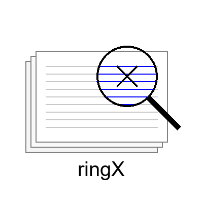

<h2 align="center">
  <br>
  Scalable Parallel Attention for Long Context Learning on HPC
</h2>
This repo supports optimized implementations of ring attention on HPC:

- ringX1: bi-directional, reduced message load, w/o pipelining
- ringX2: causal, reduced message load, unbalanced, w/o pipeling
- ringX3: causal, all-gather, balanced 
- ringX4: causal, broadcast-reduce, balanced, w/o pipeling 

### Communication Pattern and Memory Footprint

| Algo  | Comm.                                                                                              | Memory |
|-------|----------------------------------------------------------------------------------------------------|--------|
| X1/2  |  broadcast(q) all-reduce(lse) reduce(lse, out); O(hbs/N + 4bs/N)                                   | O(hbs/N)   |
| X3    |  all-gather(kv) reduce_scatter(dkv); O(4hbs/N)                                                     | O(hbs) |
| X4    |  broadcast(kv) reduce(qkv); O(4hbs/N)                                                              | O(hbs/N)   |

### Software environment 
- gcc 12.2.0
- Python 3.12.0
- Pytorch 2.4.0
- Flash attention 2.6.3
- ROCM 6.1.3
- libfabric 1.20.1
- aws-rccl-plugin 17d41cb

### Build
```bash
wget https://repo.anaconda.com/miniconda/Miniconda3-latest-Linux-x86_64.sh
bash Miniconda3-latest-Linux-x86_64.sh -b -p $PWD/miniconda3
export PATH=$PWD/miniconda3/bin:$PATH
conda create --prefix $PWD/miniconda3/envs/my_env
source $PWD/miniconda3/etc/profile.d/conda.sh
conda activate $PWD/miniconda3/envs/my_env

pip install torch==2.4.0 torchvision==0.19.0 torchaudio==2.4.0 --index-url https://download.pytorch.org/whl/rocm6.1

git clone https://github.com/Dao-AILab/flash-attention
cd flash-attention
git checkout v2.6.3
pip install -e .

DS_BUILD_FUSED_LAMB=1 pip install deepspeed == 0.15.1

git clone https://github.com/mpi4py/mpi4py.git
cd mpi4py
CC=$(which mpicc) CXX=$(which mpicxx) python setup.py build --mpicc=$(which mpicc)
CC=$(which mpicc) CXX=$(which mpicxx) python setup.py install

git clone https://github.com/ROCm/apex.git
cd apex
pip install -r requirements.txt
pip install -v --no-build-isolation --config-settings "--build-option=--cpp_ext" --config-settings "--build-option=--cuda_ext" ./
```

### Test
To test `ringX1`: 
```bash
cd script 
srun -n8 bash -c "source setup_dist_vars.sh; python ../test/test_ringX1_attn_func.py"
```

### Benchmark
To benchmark `ringX1`: 
```bash
cd script 
sbatch submit_frontier.sh ringX1_attn 
```

### ViT Application 
To train ViT models with sizes up to 2.6B and context length up to 256K: 
```bash
cd app/vit
sbatch submit_frontier_cp.sh
```
To generate the model prediction:
```bash
cd app/vit
srun -n8 bash -c "source export_DDP_vars.sh; python inference-cp8.py --config=mp_p2_ringX --tensor_parallel=1 --context_parallel=8 --parallel_order=cp-tp-dp"
```

### GPT Application  
To train a Llama3 8b model with context length up to 1M tokens: 
```bash
cd app/gpt/train
sbatch job.sb xforge/llama3-8b-1m
```
